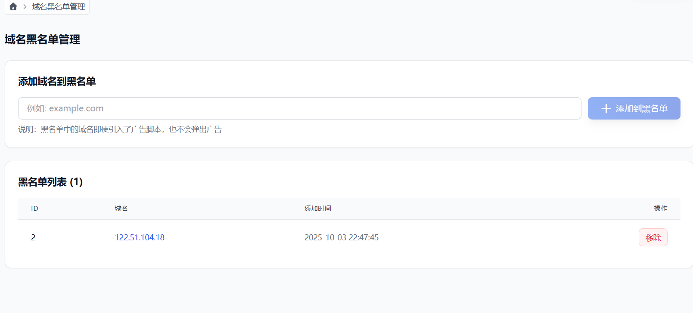
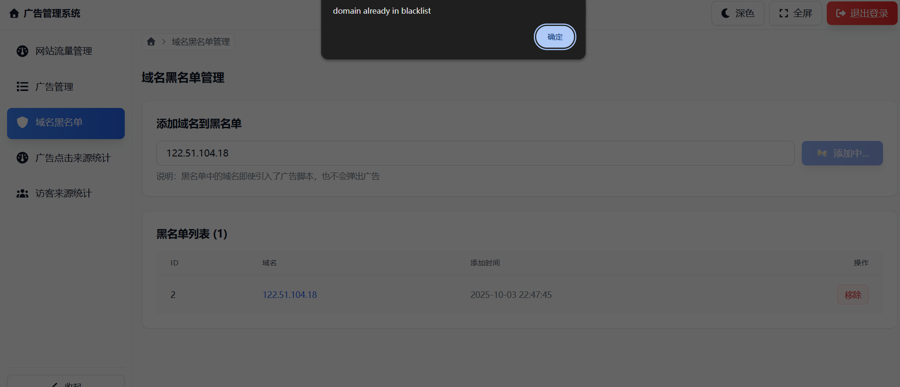
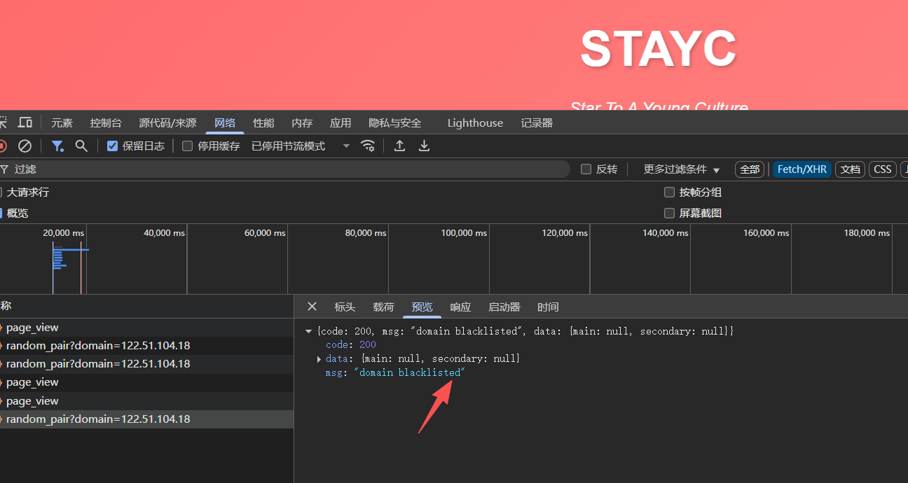

# 广告系统新功能测试操作文档

## 📋 测试概述

**测试版本**：v2.0  
**测试日期**：2025-10-03  
**测试人员**：待填写  
**测试环境**：开发/测试/生产（请标注）

---

## 🎯 本次测试功能

1. **域名黑名单功能**
   - 添加域名/IP到黑名单
   - 从黑名单移除域名/IP
   - 黑名单域名不显示广告

2. **广告弹出频率控制功能**
   - 主广告每日仅弹出一次开关
   - 次要广告每日仅弹出一次开关
   - localStorage 存储验证

---

## 🔧 测试环境准备

### 1. 后端部署确认

```bash
# 进入后端目录
cd server/ads-server

# 确认 Python 环境
python --version  # 应该是 3.8+

# 确认依赖安装
pip list | grep pymysql

# 启动服务
python run.py
```

**预期结果**：
- ✅ 服务在端口 29999 启动成功
- ✅ 控制台显示数据库连接成功
- ✅ 控制台显示创建了 `domain_blacklist` 表

### 2. 前端部署确认

```bash
# 进入前端目录
cd admin

# 确认依赖
pnpm list | grep react

# 启动开发服务器
pnpm dev
```

**预期结果**：
- ✅ 开发服务器启动成功（通常在 http://localhost:8080）
- ✅ 浏览器能正常访问管理后台

### 3. 数据库表结构验证

```sql
-- 连接数据库
USE `ads-db`;

-- 检查新表是否存在
SHOW TABLES LIKE 'domain_blacklist';

-- 检查表结构
DESC domain_blacklist;

-- 检查设置项
SELECT * FROM settings WHERE k LIKE '%once_per_day%';
```

**预期结果**：
- ✅ `domain_blacklist` 表存在，包含字段：id, domain, created_at
- ✅ settings 表中存在 `main_ad_once_per_day` 和 `secondary_ad_once_per_day` 配置项

---

## 📝 功能一：域名黑名单测试

### 测试用例 1.1：添加域名到黑名单

**操作步骤**：
1. 登录管理后台
2. 点击左侧菜单"域名黑名单"
3. 在"添加域名到黑名单"输入框中输入：`test.example.com`
4. 点击"添加到黑名单"按钮

**预期结果**：
- ✅ 提示添加成功
- ✅ 域名出现在下方黑名单列表中
- ✅ 显示添加时间

**测试截图位置**：`screenshots/blacklist-add.png`

---

### 测试用例 1.2：添加 IP 地址到黑名单

**操作步骤**：
1. 在"添加域名到黑名单"输入框中输入：`192.168.1.100`
2. 点击"添加到黑名单"按钮

**预期结果**：
- ✅ IP 地址成功添加到黑名单
- ✅ 列表中显示 IP 地址：`192.168.1.100`

OK!



---

### 测试用例 1.3：重复添加域名

**操作步骤**：
1. 尝试再次添加 `test.example.com`
2. 点击"添加到黑名单"按钮

**预期结果**：
- ✅ 显示错误提示："domain already in blacklist" 或类似信息
- ✅ 黑名单列表中仍然只有一条该域名记录

OK!

---

### 测试用例 1.4：验证黑名单生效

**准备工作**：
- 创建一个测试 HTML 页面
- 通过本地 hosts 映射或实际域名访问

**测试文件**（test-blacklist.html）：
```html
<!DOCTYPE html>
<html>
<head>
    <title>黑名单测试页面</title>
</head>
<body>
    <h1>域名黑名单功能测试</h1>
    <p>当前域名应该在黑名单中，不应该显示广告</p>
    
    <!-- 引入广告脚本 -->
    <script src="http://8.152.194.158:29999/static/ad-script.js"></script>
</body>
</html>
```

**操作步骤**：
1. 将 `test.example.com` 添加到黑名单
2. 配置 hosts 文件：`127.0.0.1 test.example.com`
3. 通过 http://test.example.com 访问测试页面
4. 打开浏览器开发者工具（F12）查看 Console 和 Network

**预期结果**：
- ✅ Console 中无广告元素创建日志
- ✅ 页面上不显示主广告和次要广告
- ✅ Network 中可以看到 `/ads/random_pair?domain=test.example.com` 请求
- ✅ 响应返回 `{"code": 200, "msg": "domain blacklisted", "data": {"main": null, "secondary": null}}`
OK!


**对比测试**：
1. 从黑名单移除 `test.example.com`
2. 刷新测试页面

**预期结果**：
- ✅ 广告正常显示（主广告居中，次要广告右下角）

OK!


---

### 测试用例 1.5：移除黑名单域名

**操作步骤**：
1. 在黑名单列表中找到 `test.example.com`
2. 点击右侧的"移除"按钮
3. 确认删除

**预期结果**：
- ✅ 域名从列表中消失
- ✅ 数据库中该记录被删除
- ✅ 该域名访问后可以正常显示广告

👌测试已通过

---

### 测试用例 1.6：IP 地址黑名单验证

**操作步骤**：
1. 添加本机 IP（如 `127.0.0.1`）到黑名单
2. 通过 `http://127.0.0.1:端口` 访问引入广告脚本的页面
3. 检查广告是否显示

**预期结果**：
- ✅ 通过 IP 访问时，广告不显示
- ✅ 行为与域名黑名单一致

👌测试已通过

---

## 📝 功能二：广告频率控制测试

### 测试用例 2.1：开启主广告每日一次

**操作步骤**：
1. 登录管理后台
2. 进入"广告管理"页面
3. 找到"投放控制"区域
4. 开启"主广告每日一次"开关

**预期结果**：
- ✅ 开关状态变为开启（蓝色）
- ✅ 数据库中 `settings` 表的 `main_ad_once_per_day` 值变为 `true`

**SQL 验证**：
```sql
SELECT * FROM settings WHERE k = 'main_ad_once_per_day';
```

---

### 测试用例 2.2：验证主广告频率控制

**操作步骤**：
1. 确保"主广告每日一次"开关已开启
2. 清除浏览器 localStorage
3. 访问引入广告脚本的测试页面
4. 观察主广告是否显示
5. 刷新页面多次
6. 检查 localStorage

**预期结果**：

**首次访问**：
- ✅ 主广告正常显示
- ✅ localStorage 中存在 `ad_main_last_shown` 键
- ✅ 值为今天的日期（格式：`YYYY-M-D`，如 `2025-10-3`）

**再次访问（同一天）**：
- ✅ 主广告不显示
- ✅ Console 中显示："主广告今日已显示，跳过"

**查看 localStorage**（F12 → Application → Local Storage）：
```javascript
// 应该看到
ad_main_last_shown: "2025-10-3"

```

👌测试已通过

---

### 测试用例 2.3：验证次要广告频率控制

**操作步骤**：
1. 开启"次要广告每日一次"开关
2. 清除浏览器 localStorage
3. 访问测试页面
4. 刷新页面多次

**预期结果**：
- ✅ 首次访问显示次要广告
- ✅ localStorage 中存在 `ad_secondary_last_shown`
- ✅ 后续访问次要广告不显示

👌测试已通过

---

### 测试用例 2.4：模拟跨天测试

**操作步骤**：
1. 开启主广告和次要广告的每日一次开关
2. 访问测试页面，确认广告显示
3. 手动修改 localStorage 中的日期为昨天
   ```javascript
   // 在浏览器 Console 中执行
   localStorage.setItem('ad_main_last_shown', '2025-10-2');
   localStorage.setItem('ad_secondary_last_shown', '2025-10-2');
   ```
4. 刷新页面

**预期结果**：
- ✅ 广告重新显示（因为日期不是今天）
- ✅ localStorage 中的日期更新为今天

---

### 测试用例 2.5：关闭频率控制

**操作步骤**：
1. 关闭"主广告每日一次"和"次要广告每日一次"开关
2. 即使 localStorage 中有今天的记录，也应该每次刷新都显示广告

**预期结果**：
- ✅ 每次刷新页面都显示广告
- ✅ 不受 localStorage 中记录的影响

👌测试已通过

---

### 测试用例 2.6：总开关控制

**操作步骤**：
1. 关闭"总开关"
2. 尝试切换"主广告每日一次"和"次要广告每日一次"

**预期结果**：
- ✅ 总开关关闭时，主广告和次要广告开关禁用（灰色，不可点击）
- ✅ 频率控制开关也禁用
- ✅ 访问测试页面，所有广告都不显示


👌测试已通过

---

## 📝 功能三：组合场景测试

### 测试用例 3.1：黑名单 + 频率控制

**操作步骤**：
1. 开启主广告每日一次
2. 访问非黑名单域名，确认主广告显示
3. 将该域名添加到黑名单
4. 刷新页面

**预期结果**：
- ✅ 黑名单优先级更高
- ✅ 即使 localStorage 中无记录，黑名单域名也不显示广告

---

### 测试用例 3.2：多域名测试

**操作步骤**：
1. 开启主广告每日一次
2. 在域名A访问，主广告显示并记录到 localStorage
3. 切换到域名B访问（相同浏览器）

**预期结果**：
- ✅ 域名B 仍然会显示主广告（localStorage 是跨域隔离的）

**注意**：如果是同一域名的不同端口，localStorage 是共享的

---

### 测试用例 3.3：不同浏览器测试

**操作步骤**：
1. 在 Chrome 浏览器中访问并触发频率控制
2. 切换到 Firefox 浏览器访问同一页面

**预期结果**：
- ✅ 不同浏览器的 localStorage 独立
- ✅ Firefox 中仍会显示广告

---

## 🔍 API 接口测试

### 接口 1：获取黑名单列表

**请求**：
```bash
curl -X GET "http://localhost:29999/domains/blacklist"
```

**预期响应**：
```json
{
  "data": [
    {
      "id": 1,
      "domain": "test.example.com",
      "created_at": "2025-10-03T10:00:00"
    }
  ]
}
```

---

### 接口 2：添加域名到黑名单

**请求**：
```bash
curl -X POST "http://localhost:29999/domains/blacklist" \
  -H "Content-Type: application/json" \
  -d '{"domain": "example.com"}'
```

**预期响应**（成功）：
```json
{
  "ok": true,
  "domain": "example.com"
}
```

**预期响应**（重复添加）：
```json
{
  "detail": "domain already in blacklist"
}
```

---

### 接口 3：删除黑名单域名

**请求**：
```bash
curl -X DELETE "http://localhost:29999/domains/blacklist/1"
```

**预期响应**：
```json
{
  "ok": true
}
```

---

### 接口 4：获取广告设置

**请求**：
```bash
curl -X GET "http://localhost:29999/ads/settings"
```

**预期响应**：
```json
{
  "global_enabled": true,
  "main_enabled": true,
  "secondary_enabled": true,
  "main_ad_once_per_day": false,
  "secondary_ad_once_per_day": false
}
```

---

### 接口 5：更新频率控制设置

**请求**：
```bash
curl -X PATCH "http://localhost:29999/ads/settings" \
  -H "Content-Type: application/json" \
  -d '{"main_ad_once_per_day": true, "secondary_ad_once_per_day": true}'
```

**预期响应**：
```json
{
  "ok": true
}
```

---

### 接口 6：获取广告（带域名参数）

**请求**：
```bash
# 非黑名单域名
curl -X GET "http://localhost:29999/ads/random_pair?domain=allowed.com"

# 黑名单域名
curl -X GET "http://localhost:29999/ads/random_pair?domain=test.example.com"
```

**预期响应（非黑名单）**：
```json
{
  "code": 200,
  "msg": "success",
  "data": {
    "main": { "id": 1, "img_url": "/static/uploads/xxx.png", ... },
    "secondary": { "id": 2, "img_url": "/static/uploads/yyy.png", ... }
  },
  "settings": {
    "main_ad_once_per_day": false,
    "secondary_ad_once_per_day": false
  }
}
```

**预期响应（黑名单）**：
```json
{
  "code": 200,
  "msg": "domain blacklisted",
  "data": {
    "main": null,
    "secondary": null
  }
}
```

---

## 🐛 常见问题排查

### 问题 1：黑名单不生效

**检查清单**：
- [ ] 确认域名是否正确添加到黑名单（检查数据库）
- [ ] 确认前端脚本正确获取了当前域名（检查 Console）
- [ ] 确认 API 请求中包含了 `domain` 参数
- [ ] 检查域名拼写是否完全一致（区分大小写）

**调试方法**：
```javascript
// 在浏览器 Console 中执行
console.log('当前域名:', window.location.hostname);
```

---

### 问题 2：频率控制不生效

**检查清单**：
- [ ] 确认开关已正确开启（检查数据库 settings 表）
- [ ] 检查 localStorage 是否有记录
- [ ] 确认日期格式正确
- [ ] 检查浏览器是否支持 localStorage

**调试方法**：
```javascript
// 查看 localStorage
console.log('主广告记录:', localStorage.getItem('ad_main_last_shown'));
console.log('次要广告记录:', localStorage.getItem('ad_secondary_last_shown'));

// 清除记录
localStorage.removeItem('ad_main_last_shown');
localStorage.removeItem('ad_secondary_last_shown');
```

---

### 问题 3：广告脚本未加载

**检查清单**：
- [ ] 检查网络请求是否成功（Network 面板）
- [ ] 确认脚本路径正确
- [ ] 检查 CORS 配置
- [ ] 查看 Console 是否有错误

---

## ✅ 测试结论模板

### 测试环境
- 操作系统：Windows 10 / macOS / Linux
- 浏览器：Chrome 118 / Firefox 119 / Safari 17
- 后端版本：Python 3.9
- 数据库：MySQL 8.0

### 测试结果汇总

| 测试用例 | 测试结果 | 备注 |
|---------|---------|------|
| 1.1 添加域名到黑名单 | ✅ 通过 | - |
| 1.2 添加IP到黑名单 | ✅ 通过 | - |
| 1.3 重复添加域名 | ✅ 通过 | - |
| 1.4 验证黑名单生效 | ✅ 通过 | - |
| 1.5 移除黑名单域名 | ✅ 通过 | - |
| 1.6 IP黑名单验证 | ✅ 通过 | - |
| 2.1 开启主广告每日一次 | ✅ 通过 | - |
| 2.2 验证主广告频率控制 | ✅ 通过 | - |
| 2.3 验证次要广告频率控制 | ✅ 通过 | - |
| 2.4 模拟跨天测试 | ✅ 通过 | - |
| 2.5 关闭频率控制 | ✅ 通过 | - |
| 2.6 总开关控制 | ✅ 通过 | - |
| 3.1 黑名单+频率控制 | ✅ 通过 | - |
| 3.2 多域名测试 | ✅ 通过 | - |
| 3.3 不同浏览器测试 | ✅ 通过 | - |

### 发现的问题
1. 无

### 测试建议
1. 建议在生产环境部署前进行完整回归测试
2. 建议准备多个测试域名和测试服务器
3. 建议在不同网络环境下测试（内网/外网）

### 测试人员签名
- 测试人员：____________
- 测试日期：____________
- 审核人员：____________

---

## 📚 附录

### A. 测试数据准备

**黑名单测试域名**：
- test.example.com
- demo.test.com
- 192.168.1.100
- 127.0.0.1

**测试账号**：
- 用户名：admin
- 密码：（根据实际环境填写）

### B. 浏览器开发者工具使用

1. **打开开发者工具**：F12 或右键 → 检查
2. **查看 Console**：点击 "Console" 标签
3. **查看 Network**：点击 "Network" 标签
4. **查看 Application**：点击 "Application" 标签 → Storage → Local Storage

### C. 参考资料

- [新功能使用说明](./新功能使用说明.md)
- [API 文档](./server/ads-server/README.md)
- [前端文档](./admin/README.md)

---

**文档版本**：v1.0  
**最后更新**：2025-10-03  
**维护人员**：开发团队

